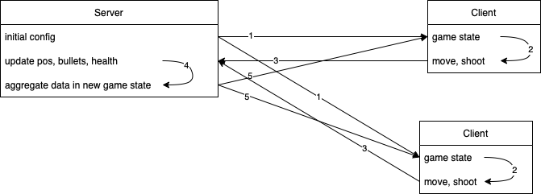

# Basic multiplayer game in python

This repo contains the code for a very basic multiplayer game built with `pygame`.

This game only supports 2 clients (the two players) and the interface only starts if there are two players connected.

The commands:
 - move with `A,S,D,W`
 - shoot with `E`

The first player that reaches `health = 0` loses.
 
## Basic logic
 
The server will listen for new clients -- that must connect to the server via websocket.
 
Then, each client will constantly send information to the server about its intentions and the server will continuously update the game status (players' position, health, ...) and broadcast the status to all players.


## How to play (on your local PC or network)

Make sure you first run the server with

```
python ws_server.py
```

and then connect with at least two clients (so run the command below from twice):

```
python ws_main.py
```

Ideally, you would deploy the server (and run the command `python ws_server.py`) from a location that the two clients, on two different computers, can reach.

## Testing

TBD

## Deploy on Heroku

To deploy on [Heroku](https://devcenter.heroku.com/articles/git), the first step is to create a new application from the web interface. Assume the app name is `example-app`, then you need to connect the git repo to the Heroku app:

```
heroku git:remote -a example-app
```

Then, simply push to Heroku to automatically start the deployment:

```
git push heroku main
```

You can try to play on Heroku after the server is deployed (and automatically executed as per the `Procfile`: change the `host` variable in the `ws_main.py` with the Heroku URL of your app. Afterwards, you should see the game window popping up.

### Check on my Heroku

My app is deployed at https://basic-multiplayer-gam.herokuapp.com/ . To activate it, go to the website first. Then, you can use the same URL as value for `host` in the `ws_main.py`.

